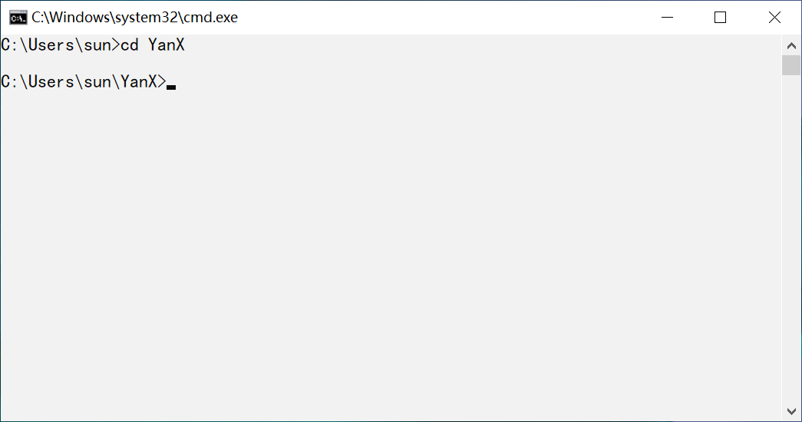
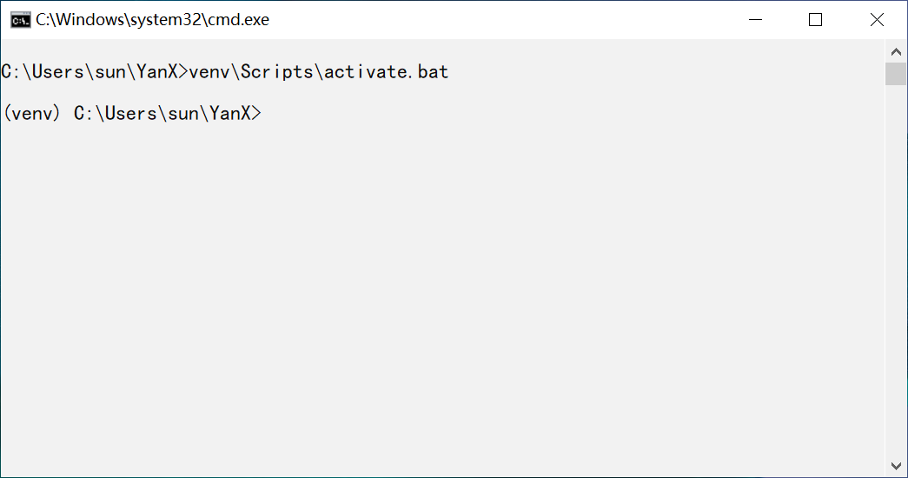

# 调试与开发

- >ps：项目代码水平比较糟糕，整体更像一个缝合怪，可能并没有太大的参考价值，

- ### [视频参考](https://www.bilibili.com/video/BV1Ce4y1Z7Nq)

## 本地调试与运行

1. 克隆项目到本地（手动下载也可）

    ```
    git clone --depth=1 https://github.com/xx025/YanX.git
    ```
    

2. 进入项目目录
    ```text
        cd YanX
    ```
    

3. 创建虚拟环境

    ```text
    virtualenv venv
    ```
    需提前安装virtualenv，[安装virtualenv](#安装virtualenv)
    

4. 激活虚拟环境(尽量使用cmd控制命令台，powershell可能有权限问题)

    ```
    venv\Scripts\activate.bat
    ```
    


5. 安装依赖库

    ```
    pip install -r requirements.txt
    ```
    

6. 运行

    ```
    python main.py
    ```
    

7. 打包

    ```
    pip install virtualenv
    pyinstaller -F -w -i img/ico.ico main.py
    ```
    需提前安装pyinstaller，[安装pyinstaller](#安装pyinstaller)
    

    打包之后请手动将img和db两个文件夹复制到打包文件位置

    
    

## 自解压

参考资料：[自解压命令: shortcut WinRAR](https://documentation.help/WinRAR-zh/HELPSFXShortcut.htm)

如果用Pyinstaller打包成一个可执行文件，那么运行这个文件会有一个解压资源的过程，导致程序启动非常慢;但如果不打包成一个文件似乎又显得十分丑陋；

好在可用使用压缩软件（Win RAR）创建自解压文件，外表上看，自解压文件仍然是一个可执行文件，他甚至可用引导用户选择自己的安装目录等奇妙的功能；

通过自解压，让这个demo显得更“正式”一点，更类似于一个成熟的带安装器的软件。

### 1. -D 参数打包

   ```
   pyinstaller -D -w -i img/ico.ico main.py
   ```
   依然将另外两个文件夹放入打包文件目录，

   看起来会是这样的：
   

### 2. 通过RAR 压缩成一个压缩包

#### 1. 在此之前，先改变文件夹名字；

   pyinstaller 默认生成的文件夹为dist\main
   我将main文件夹名字改为 YanX，在后面自解压后YanX\就是软件的目录
   
   
   
#### 2. 压缩文件
   
   
   
   
#### 3. 创建自解压文件
   
   首先再用RAR打开压缩包，选择自解压格式
   
      
   选择第一个 Default.SFX
   

#### 4. 自解压高级先选
      
1. 常规

   解压路径输入：`%APPDATA% `,选择绝对路径。这是一个环境变量，代表路径 `C:\Users\用户名\AppData\Roaming\`这个路径，

   也可以选其他的，需要注意的是有些路径涉及权限问题，其他路径参考：[环境变量](https://baike.baidu.com/item/%E7%8E%AF%E5%A2%83%E5%8F%98%E9%87%8F)

   

2. 模式

   1. 全部显示：运行自解压文件，会显示对话框，用户可用选择解压路径（建议）
   2. 隐藏启动对话框：运行自解压文件，解压到指定目录，但用户不能操作
   3. 全部隐藏：运行自解压文件后台解压，用户无感知

   

3. 高级

   点击添加快捷方式，添加一个快捷方式到桌面

   
   
   自解压文件解压后的文件夹，是`YanX\`,源文件名则是`YanX\main.exe`,快捷方式图标位于复制的静态文件文件夹`YanX\img\`下
   
   这两个路径你也可以填绝对路径，但是用户选择解压路径后，就绝对路径没那么好用了

   

4. 更新

   用户大致不会想知道你，解压的细节，所以就不用询问，做覆盖替换就好了

   

5. 确定

   最后选择确定就好了

   
   
   然后就能看到，与压缩文件同目录的自解压格式文件了
   
   

   


      
   
      
   


## 附加

### 安装virtualenv

    ```
    pip install virtualenv
    ```

### 安装 pyinstaller

    ```
    pip install pyinstaller
    ```
