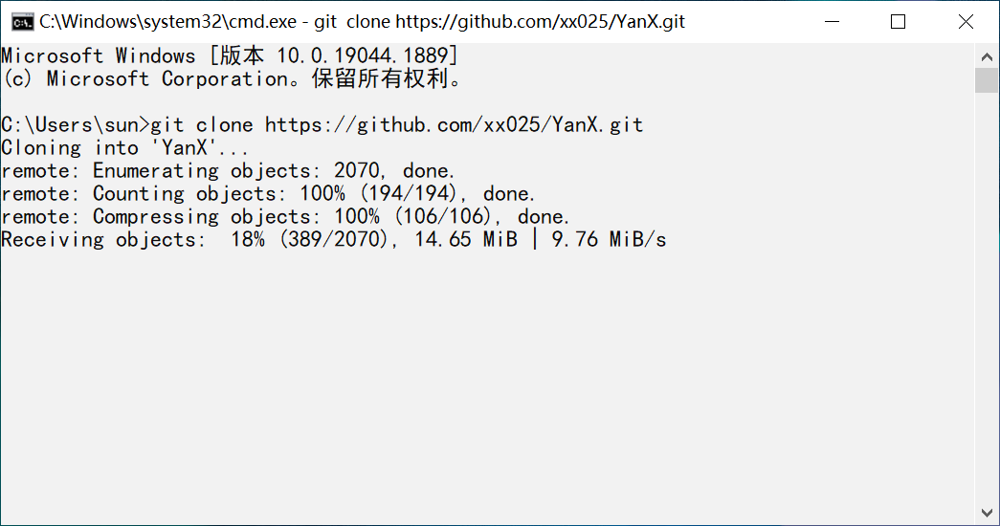
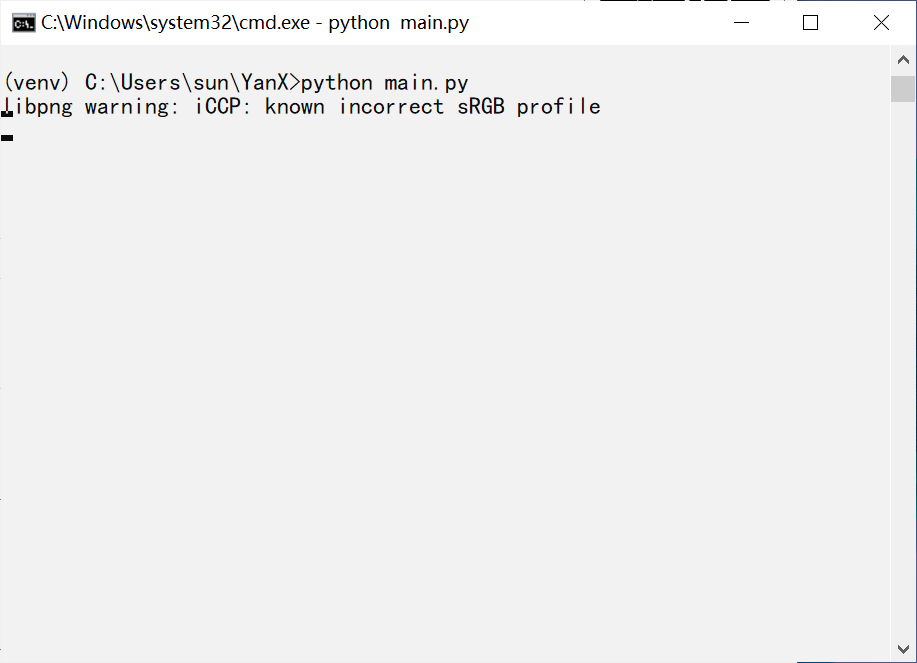

# 调试与开发

### 速达目录

[本地调试与运行](#本地调试与运行)
[安装包制作](#安装包制作)

## 本地调试与运行

1. 克隆项目到本地（手动下载也可）
   
   ```
   git clone --depth=1 https://github.com/xx025/YanX.git
   ```
   
    

2. 进入项目目录
   
   ```text
       cd YanX
   ```
   
    

3. 创建虚拟环境
   
   ```text
   virtualenv venv
   ```
   
    需提前安装virtualenv，[安装virtualenv](#安装virtualenv)
    

4. 激活虚拟环境(尽量使用cmd控制命令台，powershell可能有权限问题)
   
   ```
   venv\Scripts\activate.bat
   ```
   
    

5. 安装依赖库
   
   ```
   pip install -r requirements.txt
   ```
   
    

6. 运行
   
   ```
   python main.py
   ```
   
    

7. 打包
   
   ```
   pip install pyinstaller
   pyinstaller -F -w -i favicon.ico main.py
   ```
   
    需提前安装pyinstaller，[安装pyinstaller](#安装pyinstaller)
    
   
    打包之后请手动将img和db两个文件夹复制到打包文件位置
   
    
    

## 安装包制作

如果用Pyinstaller打包成一个可执行文件，那么运行这个文件会有一个解压资源的过程，导致程序启动非常慢;但如果不打包成一个文件似乎又显得十分丑陋；

好在可用使用各种打包软件，之前尝试了压缩软件RAR或2345zip自解压（两者都有报毒问题，遂放弃），最后找到了Inno Setup,很好用！

Inno Setup 教程：https://www.bilibili.com/video/BV15k4y1R7cL

需要注意的是，尽量不去选择C:\Program Files (x86) 这个作为安装目录，因为有权限问题

打包：
（自动将资源复制到目录中了）

```shell
pyinstaller -D -w -i favicon.ico main.py --add-data "favicon.ico;.\\"  --add-data ".\\db\\*;.\\db
```

查找替换以下字段，安装到AppData目录

```text
DefaultDirName=    {userappdata}\{#MyAppName}
DisableDirPage=yes
```

## 附加

### 安装virtualenv

```
pip install virtualenv
```

### 安装 pyinstaller

```
pip install pyinstaller
```
